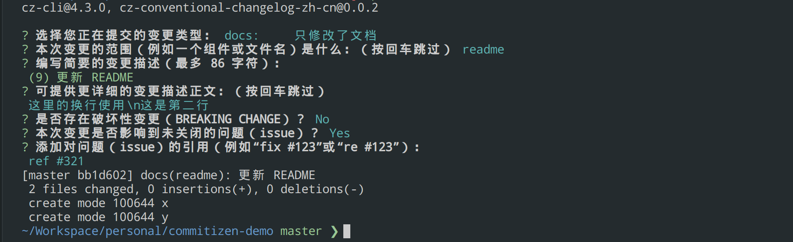
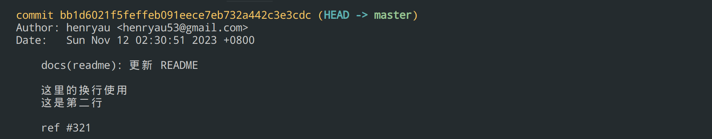

# cz-conventional-changelog-zh-cn

[](https://www.npmjs.org/package/cz-conventional-changelog-zh-cn)
[](http://npm-stat.com/charts.html?package=cz-conventional-changelog-zh-cn&from=2023-11-01)

English | [简体中文](./README.md)

Prompts for [conventional changelog](https://github.com/conventional-changelog/conventional-changelog) standard.

A fork of [cz-conventional-changelog](https://github.com/commitizen/cz-conventional-changelog), and has been sensibly localized into Simplified Chinese.

🪧 If you prefer, you can take a look at the author's [cz-conventional-template-zh-cn](https://github.com/henryau53/cz-conventional-template-zh-cn), which is an integrated template that can be applied to multi-repo projects. It may be more suitable for you.

## Screenshots





## Configuration

### package.json

Like commitizen, you specify the configuration of cz-conventional-changelog-zh-cn through the package.json's `config.commitizen` key.

```json5
{
// ...  default values
    "config": {
        "commitizen": {
            "path": "./node_modules/cz-conventional-changelog-zh-cn",
            "disableScopeLowerCase": false,
            "disableSubjectLowerCase": false,
            "maxHeaderWidth": 100,
            "maxLineWidth": 100,
            "defaultType": "",
            "defaultScope": "",
            "defaultSubject": "",
            "defaultBody": "",
            "defaultIssues": "",
            "types": {
              "feat": {
                "description": "添加新功能或功能性变化"
              },
              "fix": {
                "description": "修复 bug"
              },
              "docs": {
                "description": "只修改了文档"
              },
              "style": {
                "description": "修改了代码风格，不影响代码运行的变更"
              },
              "refactor": {
                "description": "重构代码，既不新增功能，也不是修复 bug"
              },
              "perf": {
                "description": "提升性能的代码更改"
              },
              "test": {
                "description": "增加或修改测试用例"
              },
              "build": {
                "description": "对构建过程或辅助工具和库的更改"
              },
              "chore": {
                "description": "对构建过程或辅助工具和库的更改"
              },
              "ci": {
                "description": "用于对持续集成（CI）配置文件和脚本的更改"
              },
              "revert": {
                "description": "撤销之前的提交"
              }
            }
        }
    }
// ...
}
```

> Note: The current version by default has integrated Simplified Chinese descriptions for `c`onfig.commitizen.types`. If you don't like the default descriptions, you can customize and modify them through the above configuration.

### Environment variables

The following environment variables can be used to override any default configuration or package.json based configuration.

* CZ_TYPE = defaultType
* CZ_SCOPE = defaultScope
* CZ_SUBJECT = defaultSubject
* CZ_BODY = defaultBody
* CZ_MAX_HEADER_WIDTH = maxHeaderWidth
* CZ_MAX_LINE_WIDTH = maxLineWidth

### Commitizen

Initialize your project to use the cz-conventional-changelog-zh-cn adapter, More details [commitizen](https://github.com/commitizen/cz-cli).

```bash

# npm
commitizen init cz-conventional-changelog-zh-cn --save-dev --save-exact

# yarn
commitizen init cz-conventional-changelog-zh-cn --yarn --dev --exact

# pnpm
commitizen init cz-conventional-changelog-zh-cn --pnpm --save-dev --save-exact

```

Please refer to the description of [conventional-changelog types](./meta/docs/conventional-changelog-types.md) for more information.

### Commitlint

If using the [commitlint](https://github.com/conventional-changelog/commitlint) js library, the `maxHeaderWidth` configuration property will default to the configuration of the `header-max-length` rule instead of the hard coded value of 100.  This can be ovewritten by setting the `maxHeaderWidth` configuration in package.json or the `CZ_MAX_HEADER_WIDTH` environment variable.
